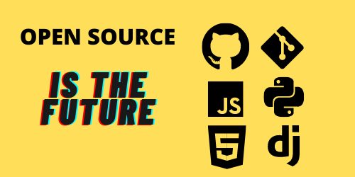

<h2 align="center">Hi There 👋</h2>

My name is Rajat Shetty and I am a Web developer, Data scientist and an Ethical hacker. I ❤️ open source software and the community supporting it. I am from 🇮🇳 and I am currently working as a freelancer

 

## Technical skills ⚙️
- Python 
- Javascript 
- Django
- Html & CSS 
- Bootstrap
- React ( Just starting out ) 
 

## My stats 📈

